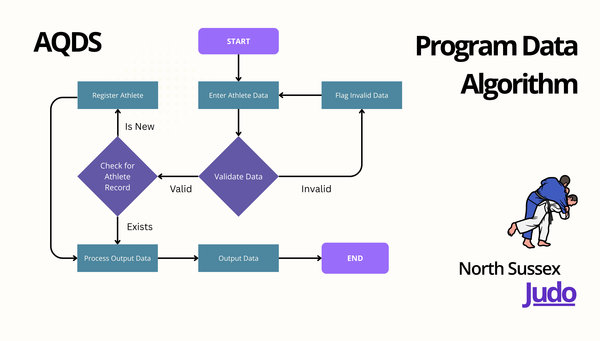

# HND Digital Technologies for England (Cyber Security)
## Module 4: Programming Assignment - Task 1

>This repository holds my __"North Sussex Judo"__ programming project.
> Directions to set up and run the program are shown at the top.
>__Fictional Entities__
> AQ Digital Solutions and North Sussex Judo refer to the
> HND Vocational Scenario and are used for Assessment purposes.
> Any similarity to existing organisations is unintended, and should
> be considered in the spirit and context in which this project exists.

Jump to the **[North Sussex Judo Report](#Introducing-North-Sussex-Judo)**

### **Repository Information:** spatial-doodle

The latest version of this document and program is always available at:
`https://github.com/arumbold/spatial-doodle`

Details about what information is contained, and where to find it are here:
**[Repository Structure](docs/repository_structure.md)**

## License & Authorship Statement
Python Source Code, documents, branding & imagery in this repository
are published under the MIT Licence and are my own work.
See the [LICENCE](LICENCE) file for details.

## Installation Requirements

### Mandatory Technologies

**Python 3** (Tested with 3.8.10 and 3.12.10)

### Recommended Additions

**pip** (for add-on compatibility)
**git** (to obtain and update the latest code)
```
git clone https://github.com/arumbold/spatial-doodle.git
cd spatial-doodle
pip install -r requirements.txt

```

## Usage

To run the Graphical Application

> python src/main.py


To generate the monthly Training Fee Report
> python src/main.py report

Other Commands available can be run in the same way
> python  src/main.py *[command]*


```
Commands available:

   report       : Create the Athlete Training Fee Report
   diagnostic   : Checks the core program functions with known data
   help         : Show usage information
```

# Introducing North Sussex Judo

This project forms part of the __HND Digital Technologies For England (Cyber Security)__ programme.
It demonstrates the full project lifecycle from getting a design brief right through to the creation of a fully-featured UI driven application.

In industry, the requirements and information gathering would likely be considered a part of the development process, which is one area where making use of Agile Development would be at a clear advantage as compared to a more pre-structured, waterfall design. For this project, the requirements are already known and clear.

I will be implementing a hybrid approach - using Agile Principles and structured algorithm creation to create a feature-based development pipeline that makes use of Test Driven Development. Tests will be identified during the Algorithm process.

## Algorithm design

The choice and construction of the algorithms required for this project are intrinsincally linked to the features defined in the assessment brief.

The requirement "North Sussex Judo requires a program to capture the following information"(Assignment Brief, 2025, paraphrased) gives us a list of program inputs for each athlete.

I will use that list to begin defining the scope of the main control-flow algorithm.

### (START)
These data fields are the entry point, the first step in understanding what the algorithm needs to do. Following the data path, I will include data elements in the control-flow sequence. This will create a combined control and data flow algorithm. This algorithm will illustrate the full process from data entry until the program has successfully "output the following information"(Assignment Brief, 2025).

### **[Enter Athlete Data](docs/ATHLETE_data.md#enter-data)**
### **[Is the data valid?](docs/ATHLETE_data.md#validation-rules-for-athlete-data)**
### **[Register Athlete](docs/ATHLETE_data.md#process-to-register-a-new-athlete)**
### **[Process Output Data](docs/ATHLETE_data.md#process-to-create-the-reports)**
### **[Output Data](docs/ATHLETE_data.md#report-contents)**
### (STOP)

Having reached the **STOP** point of the program data algorithm. we now have a high-level overview of the entire process, following the data as it flows through the application.


*Figure 1:* Program Data Flow Algorithm (Rumbold, 2025; heyrabbiticons, 2024).


This Algorithm detail, in two parts combines two levels of precision: The written elements linked have a medium depth, including a list of functions, data structures and validation critia. The Flowchart in Figure 1 shows that the high-level data and control flow through the application can be described visually. Performing this kind of analysis while removing some of the technical specifics lets us address early the experience and user journey from the **(START)** to the **(END)**.

With the present combination of inputs, outputs and processing stages the program's main components and external perimeter have been defined. It's almost time to map the steps required to create this, but first we need to dive deeper into a different algorithm.


(flowcharts, pseudocode, explanation)

## Steps from algorithm to code
(process and justification of chosen language)

## Development process
(including challenges faced and how they were addressed)
Unable to access GitHub 2FA to publish (Had created another GH Account with
student email, but wanted this to be available on my primary account)
Calculations to scale the Canva Export while complying with their licensing
criteria for publishing content to the web (LINK) as the Wrestler's image was my work included another (Public GH Repo, and wanting branding information.)

https://www.canva.com/policies/content-license-agreement/

## Debugging process and IDE features used
(breakpoints, step-through, error logs, monitoring)

## Coding standards applied and their importance

## Enhancements and optimisation of the algorithm

## Evaluation of algorithm vs final program, role of IDE, and coding standards

## Harvard-style in-text citations and full bibliography
# Reference List
Includes Canva Education-licensed element *"Yama Arashi"* by heyrabbiticons using Canva Pro element
